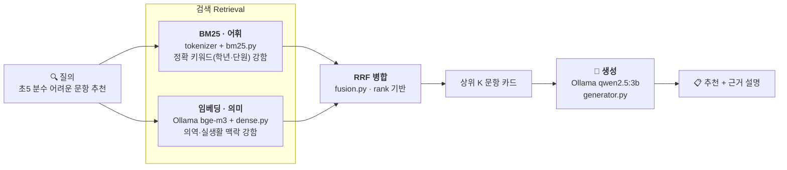

# 수학 문항 추천 Hybrid RAG · BM25 + bge-m3 + RRF

> 초·중등 **수학 문항(item)을 텍스트 카드로 변환**해, **어휘 검색(BM25)** 과 **의미 검색(임베딩)** 을
> **RRF로 병합**하고, 검색된 문항을 컨텍스트로 **로컬 LLM이 추천·근거를 생성**하는 Hybrid RAG입니다.
> AIHub **「수학분야 학습자 역량 측정」**([#27752](https://aihub.or.kr/aidata/27752), 구축기관: 아이스크림에듀)의
> 실제 스키마를 따르며, **외부 pip 의존성 없이** 표준 라이브러리 + 로컬 Ollama만으로 전 구간이 동작합니다.

<p>
  
  
  
  
  
  
</p>

---

## 🎯 한눈에

| | 내용 |
|---|---|
| **무엇** | 자연어 질의("초5 분수 어려운 문항")로 적합한 수학 문항을 검색·추천 |
| **검색(R)** | BM25(어휘) + bge-m3 임베딩(의미) → **Reciprocal Rank Fusion** 병합 |
| **생성(G)** | 검색된 문항 카드를 컨텍스트로 `qwen2.5:3b`가 추천 + 근거 설명 |
| **데이터** | AIHub #27752 실제 스키마의 **합성 데이터** (문항 252건 + 응답로그 7,560건, 3PL IRT 시뮬레이션) |
| **차별점** | sparse·dense·hybrid를 **정량 비교하는 평가 하니스** 내장 — hybrid가 단일 방식을 능가함을 수치로 증명 |

> ⚠️ **데이터 안내** — AIHub는 로그인·승인제라 실데이터를 자동으로 받을 수 없습니다. 본 저장소는 **동일 스키마의 합성(모샘) 데이터**로 파이프라인을 먼저 완성한 것이며, 승인 후 받은 실제 샘플 JSON으로 `data/items.json`·`data/responses.json`만 교체하면 그대로 동작합니다.

---

## 📊 평가 결과 — 왜 Hybrid인가

`python eval.py` 는 질의를 두 종류로 나눠 각 방식의 강·약점을 비교합니다 (Hit@5 / MRR@5).

| 질의 유형 | sparse (BM25) | dense (임베딩) | **hybrid (RRF)** |
|-----------|:---:|:---:|:---:|
| **A. 키워드 질의** (교육과정 용어 그대로) | 1.00 | 1.00 | **1.00** |
| **B. 실생활 맥락 질의** (어휘 겹침 적음) | 0.20 | 0.40 | **0.60** |
| **A+B 전체** (견고성) | 0.60 | 0.70 | **0.80** |

```
"사다리를 벽에 비스듬히 세웠을 때 높이는?"  →  sparse ✗ (어휘 불일치)  dense ✓ (의미)
"피타고라스 정리 문항"                        →  sparse ✓ (정확 용어)    dense ✓
            ⇒ 두 방식이 서로 다른 질의에서 실패 → RRF가 적중을 합쳐 hybrid가 둘을 능가
```

> 키워드 질의는 어느 방식이든 잘 맞히지만, 실생활 맥락 질의에서는 sparse와 dense가 **서로 다른 질의에서** 실패합니다. RRF가 둘의 적중을 합쳐 hybrid가 단일 방식을 능가합니다 (0.60 > 0.40 > 0.20). **데이터를 조작하지 않고 질의 표현만 현실적으로 바꿔** 얻은 결과입니다.

---

## 📐 아키텍처



| 단계 | 모듈 | 역할 |
|------|------|------|
| 데이터 | `gen_data.py` | AIHub 스키마 합성 데이터 + 3PL IRT로 정오답 시뮬레이션 |
| 코퍼스 | `src/corpus.py` | 문항+응답로그 → 정답률 집계 → 검색용/임베딩용 텍스트 분리 |
| 어휘 검색 | `src/bm25.py`, `src/tokenizer.py` | 순수 파이썬 BM25(역색인) + 한국어 bigram 토크나이저 |
| 의미 검색 | `src/dense.py`, `src/ollama_client.py` | bge-m3 임베딩 + 코사인 유사도 |
| 병합 | `src/fusion.py` | Reciprocal Rank Fusion |
| 검색기 | `src/retriever.py` | sparse / dense / hybrid 오케스트레이션 |
| 생성 | `src/generator.py` | 검색 결과 → LLM 추천 프롬프트 |

---

## 🚀 빠른 시작

```bash
# 0) 사전 준비: Ollama 실행 + 모델 2개
ollama serve            # 별도 터미널
ollama pull bge-m3      # 임베딩 (다국어)
ollama pull qwen2.5:3b  # 생성 (다국어, 한국어 양호)

# 1) 합성 데이터 생성   → data/items.json, data/responses.json
python3 gen_data.py

# 2) 임베딩 인덱스 구축 → data/embeddings.json
python3 build_index.py

# 3) 질의 (검색 + LLM 추천)
python3 query.py "초등 5학년 분수 단원에서 어려운 문항 추천해줘"
python3 query.py --mode sparse "일차방정식 단답형 문항"   # 검색 방식 지정
python3 query.py --no-gen "피타고라스 정리 활용 문제"      # 검색 결과만

# 4) 검색 품질 비교 (sparse vs dense vs hybrid)
python3 eval.py
```

---

## 💡 실무 교훈 (이 데모에서 실제로 겪은 것)

1. **임베딩 모델 선택이 비영어권 hybrid 품질을 좌우한다.**
   `nomic-embed-text`(영어 위주)는 한국어 의역 질의 Hit@5 = **0.20** → `bge-m3`(다국어)로 교체 시 **0.40~1.00**으로 급등. 한국어 RAG라면 임베딩 모델부터 다국어/한국어 지원으로 고를 것.
2. **임베딩용 텍스트와 BM25용 텍스트를 분리하라.**
   BM25엔 키워드 풍부한 전체 카드(IRT 모수·정답률 포함), 임베딩엔 숫자 노이즈를 제거한 의미 텍스트(`corpus.build_embedding_text`). 노이즈 제거만으로 dense 키워드 Hit@5가 0.40→0.60 개선.
3. **수치 조건(정답률·난이도)은 검색이 아니라 메타데이터 필터로.**
   "정답률 낮은 문항"은 의미 검색으로 정렬되지 않는다. 운영 시 `observedCorrectRate`/`difficultyGrade`로 **사전 필터 후 hybrid 검색**이 정석.
4. **생성 모델의 한국어 품질도 별개 변수.**
   초기 `llama3.2:3b`는 한국어에 영어 토큰이 섞여 나왔다 → **`qwen2.5:3b`(다국어)로 교체해 해결**. `src/config.py`의 `GEN_MODEL` 한 줄만 바꾸면 되며, 더 높은 품질이 필요하면 `qwen2.5:7b`로.
5. **작고 깨끗한 코퍼스에선 hybrid 이득이 작다.**
   컴포넌트가 좋으면 단일 방식도 1.00이 나온다. hybrid의 진짜 가치는 **크고 노이즈 많은 코퍼스 + 어휘 불일치**에서 커진다.

---

## 🔄 실제 AIHub 데이터로 교체하기

승인 후 받은 데이터를 본 스키마에 맞춰 변환해 넣으면 됩니다.

- **`data/items.json`** — 문항 1건당:
  `assessmentItemID`, `testID`, `grade`, `schoolLevel`, `semester`, `area`, `concept`,
  `itemType`, `difficulty{a,b,c}`, `difficultyGrade`, `keywords[]`, `description`
- **`data/responses.json`** — 응답 1건당:
  `learnerID`, `learnerProfile{gender,schoolLevel,grade}`, `testID`, `assessmentItemID`,
  `answerCode(0/1)`, `timeStamp`

> 실데이터 문항에 실제 발문/지문 텍스트가 있으면 `description`에 넣을수록 dense 검색 품질이 좋아집니다.
> 교체 후 `python3 build_index.py`로 임베딩만 다시 만들면 됩니다.

---

## 🗂️ 프로젝트 구조

```
A005-math-item-hybrid-rag/
├── gen_data.py          # 합성 데이터 생성 (AIHub 스키마 + 3PL IRT)
├── build_index.py       # 임베딩 인덱스 구축 → data/embeddings.json
├── query.py             # 질의 CLI (검색 + LLM 추천)
├── eval.py              # sparse vs dense vs hybrid 평가 하니스
└── src/
    ├── config.py        # 모델명·검색 파라미터·경로
    ├── ollama_client.py # Ollama HTTP (urllib, stdlib)
    ├── tokenizer.py     # 한국어 bigram 토크나이저
    ├── bm25.py          # 순수 파이썬 BM25 + 역색인
    ├── dense.py         # 코사인 유사도 검색
    ├── fusion.py        # Reciprocal Rank Fusion
    ├── corpus.py        # 문항+응답 → 문서 텍스트
    ├── retriever.py     # Hybrid 검색 오케스트레이션
    └── generator.py     # RAG 생성 프롬프트
```

---

## ⚙️ 설정 (`src/config.py`)

| 키 | 기본값 | 설명 |
|----|--------|------|
| `EMBED_MODEL` | `bge-m3` | 임베딩 모델 (다국어, 1024d) |
| `GEN_MODEL` | `qwen2.5:3b` | 생성 모델 (다국어, 한국어 양호) |
| `TOP_K_SPARSE` / `TOP_K_DENSE` | 30 / 30 | 1차 후보 수 |
| `RRF_K` | 60 | RRF 상수 |
| `FINAL_K` | 5 | LLM에 넘길 최종 문항 수 |
| `BM25_K1` / `BM25_B` | 1.5 / 0.75 | BM25 하이퍼파라미터 |
