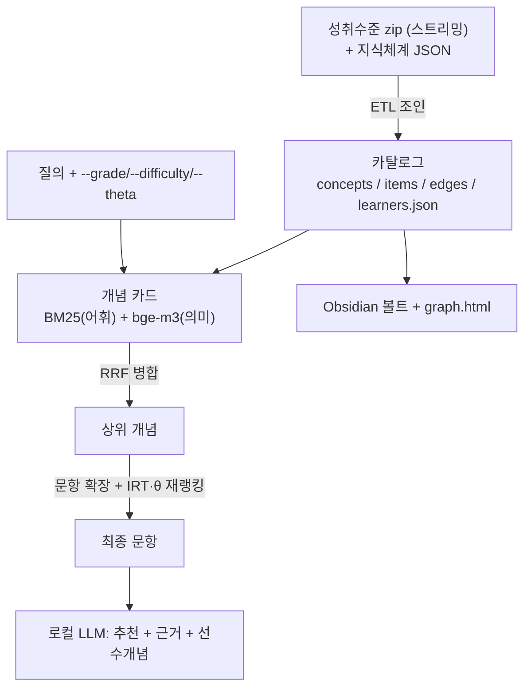
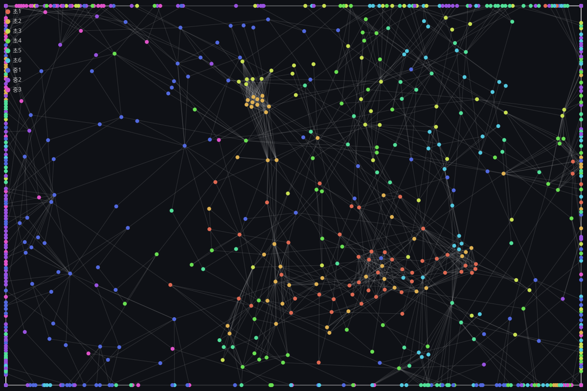

# 수학 개념·문항 추천 Hybrid RAG · BM25 + bge-m3 + RRF + IRT

> AIHub **「수학분야 학습자 역량 측정」**([#27752](https://aihub.or.kr/aidata/27752), 구축: 아이스크림에듀)
> **실데이터**로 만든 개념–문항 지식베이스 위에서, 자연어 질의를
> **어휘 검색(BM25)** 과 **의미 검색(bge-m3 임베딩)** 으로 병합(**RRF**)하고,
> **IRT 난이도·학습자 θ**로 재랭킹해 문항을 추천하며, 결과를 **로컬 LLM**이 근거와 함께 설명합니다.
> 산출물은 **Obsidian 볼트 + `graph.html`**(개념 선후관계 그래프)로 내보냅니다.
> **외부 pip 의존성 없이** 표준 라이브러리 + 로컬 [Ollama](https://ollama.com)만으로 전 구간이 동작합니다.

<p>
  
  
  
  
  
  
</p>

> 🔗 **라이브 데모** (Vercel, 외부 라이브러리 없이 정적 배포):
> - **[Hybrid RAG 파이프라인 데모](https://a005-math-item-hybrid-rag.vercel.app/)** — 질의가 **BM25(어휘) ∥ bge-m3(의미) → RRF 병합 → IRT·θ 재랭킹 → LLM 근거 생성**을 거치는 전 과정을 단계별로 시각화(예시 질의 미리 계산). 두 검색이 합쳐지며 **양쪽에 다 나온 개념이 상위로 올라가는** 하이브리드의 핵심이 그대로 보입니다.
> - **[개념 선후관계 3D 지식그래프](https://a005-math-item-hybrid-rag.vercel.app/graph.html)** — RAG가 검색하는 **지식베이스(코퍼스)**. 912개념·1,633 선후간선을 학년별 색의 3D 인터랙티브(회전·확대·클릭 상세·학년 필터·접근성)로 표현.

---

## 무엇이 "완성본"인가

기존 버전은 스키마를 흉내 낸 **합성 데이터**로 동작했습니다. 이 완성본은 **AIHub #27752 실데이터**를
그대로 사용합니다. 이 데이터는 두 하위 데이터셋으로 구성됩니다.

| 하위 데이터셋 | 내용 | 이 프로젝트에서의 역할 |
|---|---|---|
| **학습자 성취수준** | 문항 IRT(난이도·변별도·추측도·`knowledgeTag`), 정오답 로그(196만), 응시자 IRT(θ) | 문항↔개념 연결, 실측 정답률, 난이도·θ 재랭킹 |
| **수학 지식체계** | 개념명·설명·단원(대>중>소)·성취기준 + `fromConcept→toConcept` 선후관계(3,446 간선) | 검색 텍스트의 뼈대, Obsidian 지식그래프 |

**핵심 조인**: 문항의 `knowledgeTag`(예 `7811`)가 지식체계의 개념 `id`와 **약 94% 매칭**됩니다.
이 조인 덕분에 "문항에 지문 텍스트가 없다"는 한계를 개념 텍스트로 메워 Hybrid RAG가 성립합니다.
(미매칭 6%는 `미분류 개념` 폴백으로 흡수하고 카운트를 로그로 표기합니다.)

## 왜 검색 단위가 '개념'인가

문항 9,454개는 다수가 **같은 개념 텍스트를 공유**합니다. 문항 단위 임베딩은 중복·낭비이고
의미 검색이 개념 클러스터를 통째로 반환합니다. 그래서 **개념(문항이 참조하는 912개) 단위로 인덱싱**하고,
질의 → 상위 개념 → 그 개념의 문항으로 **확장한 뒤 IRT 난이도·θ로 재랭킹**합니다.
결과적으로 "개념 → 대표문항"이 자연스럽게 산출되어 Obsidian 표현과도 잘 맞습니다.

## 아키텍처



## 빠른 시작

### 0) 사전 준비

```bash
# Ollama 모델 (임베딩 / 생성)
ollama pull bge-m3
ollama pull qwen2.5:3b
```

AIHub #27752에서 **두 하위 데이터셋을 모두** 내려받습니다(성취수준 + 지식체계).
원천 경로는 환경변수로 지정할 수 있습니다(기본값은 `src/config.py`의 `RAW_DATA_DIR`).

```bash
export MATH_DATA_DIR="/path/to/수학분야 학습자 역량 측정 데이터"
```

### 1) 카탈로그 빌드 (ETL)

```bash
python build_catalog.py                 # 전량 (196만 로그 1-pass, 수 분 소요)
python build_catalog.py --grade 3학년    # 특정 학년만 (빠른 확인용, 반복 지정 가능)
python build_catalog.py --limit 200000   # 정오답 집계 상한 (개발용)
```

### 2) 개념 임베딩 인덱스

```bash
python build_index.py
```

### 3) 질의

```bash
python query.py "초등 3학년 분수 크기 비교 쉬운 문항"
python query.py --grade 초3 --difficulty 하 "분수 비교"
python query.py --learner 저성취 "곱셈 문항"        # learners.json 대표 θ 사용
python query.py --mode sparse --no-gen "원의 반지름"  # 검색만(생성 생략)
```

옵션: `--mode {hybrid,sparse,dense}` · `--grade` · `--difficulty {상,중,하}` ·
`--theta FLOAT` · `--learner LABEL/ID` · `--k N` · `--no-gen`

### 4) Obsidian 내보내기

```bash
python export_obsidian.py
```

- `vault/concepts/{tag} {개념명}.md` — frontmatter(학년·단원·IRT·정답률) + 설명 + `[[선수개념]]`/`[[후속개념]]`/`[[대표문항]]`
- `vault/units/대단원 *.md` — 대단원 MOC
- `vault/items/{문항ID}.md` — 개념당 대표문항(난이도 상/중/하 커버)
- `graph.html` / `public/graph.html` — 라이브러리 없는 단독 **3D 개념 선후관계 그래프**(학년별 색 · 회전·확대·클릭 상세·학년 필터·접근성)

`vault/` 폴더를 Obsidian에서 열면 개념 위계가 그래프 뷰로 드러납니다.

### 5) 웹 데모 생성 (Hybrid RAG 파이프라인)

```bash
python build_demo.py     # 예시 질의의 전체 파이프라인을 미리 계산 → public/index.html
```

- `public/index.html` — 질의 → BM25 ∥ bge-m3 → RRF → IRT/θ 재랭킹 → LLM 을 단계별로 보여주는 **파이프라인 데모**(정적, 웹 메인)
- `public/graph.html` — 3D 지식그래프(코퍼스). `export_obsidian.py`가 함께 생성
- `vercel.json` 이 `public/`을 그대로 정적 배포 → [라이브](https://a005-math-item-hybrid-rag.vercel.app/)

### Obsidian 미리보기

**개념 선후관계 그래프** (전량 912개념 · 1,633 선후간선, 학년별 색):



> 인터랙티브 3D 버전: **[라이브 3D 지식그래프](https://a005-math-item-hybrid-rag.vercel.app/graph.html)**(Vercel) 또는 저장소의 [`graph.html`](graph.html)을 브라우저로 열면 회전·확대·클릭 상세가 됩니다. (웹 메인은 [Hybrid RAG 파이프라인 데모](https://a005-math-item-hybrid-rag.vercel.app/))

**개념 노트 예시** (`vault/concepts/1707 원의 중심, 반지름, 지름.md`):

```markdown
---
tag: 1707
grade: 초3
semester: 초등-초3-2학기
대단원: 원
중단원: 원의 중심, 반지름, 지름을 알아볼까요
성취기준: 원의 중심, 반지름, 지름을 알고, 그 관계를 이해한다.
avg_b: -0.9831
band: 중
correct_rate: 75.2
item_count: 16
---

# 원의 중심, 반지름, 지름

## 선수개념
- (없음)

## 후속개념
- [[1720 원의 성질]]

## 대표문항
- [[A030174005]] (난이도 하, 정답률 52.1%)

## 단원
[[대단원 원]]
```

## 검색 품질 비교 (eval)

```bash
python eval.py
```

키워드 질의(BM25 유리) / 의역 질의(임베딩 유리) / 전체(견고성) 세 축으로
`sparse · dense · hybrid`의 Hit@5·MRR@5를 비교합니다.

실측 결과(전량 912개념 인덱스, bge-m3, 질의 16건):

| 질의셋 | sparse | dense | **hybrid** |
|---|:---:|:---:|:---:|
| A. 키워드 (8건) | 1.00 | 1.00 | **1.00** |
| B. 의역 (8건) | 0.50 | 0.62 | **1.00** |
| **A+B 전체 (16건)** | 0.75 | 0.81 | **1.00** |

*(Hit@5)* 키워드 질의는 셋 다 강하지만, **의역 질의에서 sparse 0.50 / dense 0.62로 떨어지는 반면 hybrid는 1.00으로 견고**합니다.
단일 방식(sparse/dense)은 한쪽에서 약해지지만 hybrid는 양쪽에서 최고 — 이것이 RRF 병합의 핵심 가치입니다.

## 프로젝트 구조

```
build_catalog.py     # 실데이터 → 카탈로그 ETL
build_index.py       # 개념 임베딩 캐시
query.py             # 추천 CLI (검색→재랭킹→생성)
export_obsidian.py   # 볼트 + 3D graph.html
build_demo.py        # Hybrid RAG 파이프라인 데모 생성(public/index.html)
eval.py              # sparse/dense/hybrid 비교
src/
  etl.py             # 지식체계 파싱 + zip 스트리밍 조인
  irt.py             # 난이도 밴드 · 질의 파싱 · θ 적합도
  knowledge_graph.py # 선후관계 조회
  corpus.py          # 개념 카드(BM25/임베딩 텍스트)
  recommender.py     # 개념→문항 확장 + IRT/θ 재랭킹
  retriever.py bm25.py dense.py fusion.py tokenizer.py  # 검색 코어
  generator.py ollama_client.py                          # 생성
  obsidian_export.py # 볼트 + 3D 지식그래프(graph.html/SVG)
  pipeline_demo.py   # Hybrid RAG 파이프라인 데모 렌더러
public/              # 웹 배포물(index.html=파이프라인 데모, graph.html=3D 그래프)
.github/workflows/   # main 머지 → Vercel 자동배포 + 태그
tests/               # stdlib unittest (etl/irt/graph/recommender/export/fusion)
docs/superpowers/    # 설계 스펙 · 구현 계획
```

## 설계 원칙

- **로컬 우선·키 불필요**: 외부 pip 의존성 0, 런타임은 로컬 Ollama만.
- **실데이터 재현성**: 원천/산출물은 커밋하지 않고(빌드로 재생성), 위 절차로 누구나 동일 결과 재현.
- **무음 실패 금지**: 조인 미매칭·고아 간선·미기동을 카운트/메시지로 표면화.

## 배포 자동화 (CI/CD)

`main`에 머지되면 GitHub Actions(`.github/workflows/deploy.yml`)가 자동으로:

1. 커밋된 정적 산출물(`public/`)을 **Vercel 프로덕션에 배포**
2. `deploy-<타임스탬프>` **릴리스 태그 push**
3. 배포 URL을 **Actions 실행 요약(Summary)** 에 표시하고, URL이 바뀌면 `README`·`.deploy-url` 자동 갱신

필요한 저장소 시크릿(Settings → Secrets and variables → Actions):

| 시크릿 | 설명 |
|---|---|
| `VERCEL_TOKEN` | [vercel.com/account/tokens](https://vercel.com/account/tokens) 발급 |
| `VERCEL_ORG_ID` | `vercel link` 후 `.vercel/project.json` 의 `orgId` |
| `VERCEL_PROJECT_ID` | 같은 파일의 `projectId` |

> 콘텐츠 재생성(`build_catalog`/`build_index`/`export_obsidian`/`build_demo`)은 원천 데이터 + 로컬 Ollama가 필요하므로 **로컬에서 수행**하고, CI는 커밋된 `public/`만 배포합니다.

## 테스트

```bash
python -m unittest discover -s tests
```

순수 로직(ETL 조인·IRT·그래프·재랭킹·Obsidian 생성·RRF)을 소형 픽스처로 검증합니다.
임베딩·생성은 로컬 Ollama가 필요한 런타임 경로입니다.
